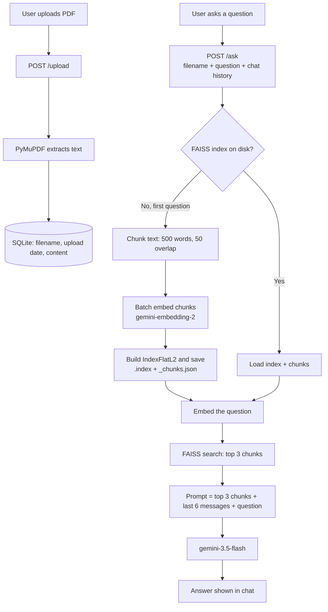

# PDF and AI qna (PDFAI) — v2: FAISS Vector Search + Chat Memory

PDFAI is an AI-powered PDF assistant. Upload a PDF, pick it from the dropdown, and ask questions about it in a chat interface. Answers are generated by Google's **Gemini API**.

> **v2 (current)** — Retrieval-Augmented Generation (RAG) using **Gemini embeddings + a persistent FAISS vector index**, with **conversation memory** so follow-up questions work.
>
> **v1 (previous)** — Manual 300-word chunking, prompt-only, no vector database. v1 is kept documented below under [Version History & What I Learned](#version-history--what-i-learned) because it's the foundation this version was built on.

---

## What's New in v2

| | **v1 — Manual chunking** | **v2 — Vector search + memory** |
|---|---|---|
| Chunking | Fixed 300-word chunks | 500-word chunks with 50-word overlap |
| Finding relevant text | Prompt-based logic, no vector DB | Semantic search with embeddings (`gemini-embedding-2`) |
| Vector store | None | **FAISS** (`IndexFlatL2`), saved to disk per PDF |
| Re-use across questions | Chunked again on every question | Index built once, then loaded from disk |
| Chat memory | None — every question was independent | Last 6 messages are sent along with each question |
| Answer model | Gemini Pro | `gemini-3.5-flash` |
| Dependency management | `requirements.txt` + pip | `pyproject.toml` + `uv.lock` (uv) |

## Features

- **AI-Powered Q&A** — Ask natural-language questions about your uploaded PDF.
- **Semantic Search (RAG)** — The question is embedded and matched against the PDF's chunks, and only the top 3 most relevant chunks are sent to Gemini.
- **Persistent FAISS Index** — Each PDF's index and chunks are saved in `backend/vector_stores/`, so the embedding cost is paid once per document, not once per question.
- **Chat Memory** — Follow-up questions ("explain that in simpler words") work because recent conversation turns are included in the prompt.
- **PDF Text Extraction** — Full text extraction using PyMuPDF.
- **Multiple PDFs** — Upload several PDFs and switch between them from the dropdown; each has its own index.
- **React Frontend** — Built with Vite and React, with markdown-rendered answers.
- **FastAPI Backend** — Handles file storage, text extraction, indexing, retrieval and Gemini calls.

## Tech Stack

### Frontend
- React.js (v19)
- Vite
- Material UI icons
- react-markdown
- CSS

### Backend
- FastAPI
- PyMuPDF (fitz) — PDF text extraction
- **FAISS (`faiss-cpu`)** — vector similarity search
- **NumPy** — embedding matrices
- Google Gemini API (`google-genai`) — embeddings + answer generation
- SQLite — stores PDF metadata and extracted text

---

## How It Works (v2)



### The memory state

Memory in v2 is deliberately simple and **stateless on the server**:

1. The React `Container` component keeps all messages in its state.
2. On every question it sends the previous user/assistant messages as `history` in the `/ask` request.
3. The backend keeps only the **last 6 messages** (about 3 question-answer exchanges) and puts them in the prompt under *Previous Conversation*.
4. Gemini answers using both the retrieved document chunks and that conversation history.

Because the history lives in the browser, the backend needs no session storage, which keeps deployment easy. The trade-off is that the memory resets when you refresh the page or switch to a different PDF.

---

## Installation & Setup

### 1. Clone the Repository

```bash
git clone https://github.com/Parth050812/PDFAI.git
cd PDFAI
```

### 2. Frontend setup (Vite + React)

The frontend is built with React + Vite. Go into the frontend folder, install the dependencies and start it at [http://localhost:5173/](http://localhost:5173/)

```bash
cd frontend
npm install
npm run dev
```

### 3. Backend setup (FastAPI)

The backend needs **Python 3.12** and uses [uv](https://docs.astral.sh/uv/) for dependencies (`pyproject.toml` + `uv.lock`).

```bash
cd backend
uv sync
```

Create a **.env** file inside `backend/` for your Gemini API key. You can get a free key from Google AI Studio: [https://aistudio.google.com/app/apikey](https://aistudio.google.com/app/apikey)

```env
GEMINI_API_KEY=your_gemini_api_key_here
```

Start the backend server:

```bash
uv run uvicorn main:app --reload
```

### 4. Running locally (important)

The project is currently configured for the deployed version. For local development, switch these two lines:

- `frontend/src/Nav.jsx` and `frontend/src/Container.jsx` — use `const url = "http://127.0.0.1:8000";` instead of the Render URL.
- `backend/main.py` — use `allow_origins=["http://localhost:5173"]` in the CORS middleware.

### Optional: check your Gemini models

`backend/test.py` lists every model your API key can access, split into text-generation and embedding models. Run it with `uv run python test.py` if a model name stops working.

---

## API Endpoints (FastAPI)

<table border="0" >
  <tr>
    <th width="200px">Method</th>
    <th width="200px">Endpoint</th>
    <th width="500px">Description</th>
  </tr>
  <tr>
    <td align="center">GET</td>
    <td align="center">/</td>
    <td>Health check — returns <code>{"success": "backend running"}</code>.</td>
  </tr>
  <tr>
    <td align="center">POST</td>
    <td align="center">/upload</td>
    <td>Saves the uploaded PDF, extracts its text with PyMuPDF and stores it in SQLite.</td>
  </tr>
  <tr>
    <td align="center">GET</td>
    <td align="center">/pdfs</td>
    <td>Returns the list of stored PDF filenames (used for the dropdown).</td>
  </tr>
  <tr>
    <td align="center">POST</td>
    <td align="center">/ask</td>
    <td>Takes <code>filename</code>, <code>question</code> and <code>history</code>. Retrieves the top 3 relevant chunks from the PDF's FAISS index and returns a Gemini-generated answer that also considers the recent chat history.</td>
  </tr>
</table>

Example `/ask` request body:

```json
{
  "filename": "deadlock.pdf",
  "question": "What are the four conditions for deadlock?",
  "history": [
    { "role": "user", "content": "What is a deadlock?" },
    { "role": "assistant", "content": "A deadlock is a situation where..." }
  ]
}
```

---

## Application Architecture Overview

### 1. Frontend (React + Vite)
Responsibilities:
- Lets users upload PDF files.
- Shows a dropdown to select a file.
- Provides a chat-style interface to ask questions and view AI responses (rendered as markdown).
- Holds the chat history (the memory state) and sends it with every question.
- Handles loading states and smooth user interaction.

### 2. AI Backend (FastAPI + FAISS + Gemini API)
Responsibilities:
- Receives PDF files and extracts text using PyMuPDF.
- Stores the extracted text in a SQLite database.
- On the first question for a PDF: splits the text into overlapping 500-word chunks, embeds them in one batch call, builds a FAISS index and saves it to disk.
- On later questions: loads the saved index, embeds the question and retrieves the top 3 chunks.
- Builds a prompt from the retrieved chunks + recent chat history + the question and gets the answer from Gemini.

### 3. Communication Flow
1. User uploads a PDF via the frontend (`/upload`).
2. Backend extracts the text and stores it in the database.
3. User selects a file and asks a question.
4. Frontend sends the question, filename and chat history to `/ask`.
5. Backend loads (or builds) the FAISS index, retrieves the 3 most similar chunks and queries Gemini.
6. The AI answer is returned to the frontend and displayed in the chat.

### Workflow diagram (v1)
The diagram below is from v1 (manual chunking). The v2 flow is the Mermaid diagram at the top of this README.


---

## Version History & What I Learned

### v1 — Manual chunking, no vector database
The first version was built to keep the architecture as simple as possible:
- Extracted the PDF text with PyMuPDF and stored it in SQLite.
- Split the text into **manual 300-word chunks**.
- Used **purely prompt-based logic** to answer questions — no embeddings, no vector database.
- Every question was independent; there was no chat memory.

**What v1 taught me:**
- A simple pipeline is a great way to understand the full flow (upload → extract → store → ask → answer) before adding complexity.
- Fixed-size chunking works for small documents, but the system has no real notion of *which* chunk is relevant to a question — it only splits text, it doesn't search it.
- Without memory, follow-up questions such as "explain that again" have nothing to refer to.

### v2 — FAISS vector search + memory (this version)
I rebuilt the retrieval layer as a proper RAG pipeline:
- Replaced the 300-word manual chunks with **500-word chunks and a 50-word overlap**, so sentences cut at a chunk boundary still appear in the next chunk.
- Added **embeddings** so chunks are matched to a question by meaning, not just by position.
- Added a **FAISS index saved to disk**, so a document is embedded once and re-used for every later question.
- Added **chat history** so the assistant can follow the conversation.
- Switched to `uv` with `pyproject.toml` / `uv.lock` for reproducible installs.

**What v2 taught me:**
- Retrieval quality matters more than model size: sending only the 3 most relevant chunks keeps the prompt small and focused.
- Persisting the index is a big practical win — the expensive embedding step only happens on the first question for a PDF.
- Memory can live on the client and travel with each request, so the backend stays stateless.

### Known limitations & ideas for v3
- **Follow-ups and retrieval:** search uses only the current question text. A vague follow-up like "why?" retrieves poorly because the history isn't used for searching. A query-rewriting step (turn the follow-up into a standalone question first) would fix this.
- **Re-uploading a PDF with the same filename:** the text in SQLite is updated, but an existing FAISS index for that filename is re-used, so the old index can go stale. Deleting the old index on upload would fix this.
- **Memory is per page session:** it resets on refresh or when switching PDFs. Persisting chat history in SQLite would make it last.
- **Large PDFs:** all chunks are embedded in a single batch call, so very long documents may hit API batch limits and would need batching.
- **Index timing:** the index is built on the first question, not at upload time, so the first answer for a new PDF is slower.
- **Ephemeral hosting:** on Render's free tier, files in `tmp/uploads` and `vector_stores` can be wiped on redeploy (the index is rebuilt automatically from the database text on the next question).
- **Distance metric:** `IndexFlatL2` is used; cosine similarity (normalised vectors + inner product) is worth comparing.
- **Source citations:** showing page numbers or the retrieved chunks next to each answer.

---

## Project Tree

```bash
.
├── LICENSE
├── README.md
├── frontend
│   ├── eslint.config.js
│   ├── index.html
│   ├── package.json
│   ├── package-lock.json
│   ├── vite.config.js
│   ├── README.md
│   ├── public
│   │   ├── head.png
│   │   ├── logo.ico
│   │   └── vite.svg
│   └── src
│       ├── App.css
│       ├── App.jsx          (contains the Nav and Container components)
│       ├── Container.css
│       ├── Container.jsx    (chat messages, AI responses and the chat-history memory state)
│       ├── Nav.css
│       ├── Nav.jsx          (header: upload a PDF and select which PDF to ask about)
│       ├── index.css
│       ├── main.jsx
│       └── assets
│           └── react.svg
└── backend
    ├── .python-version      (Python 3.12)
    ├── pyproject.toml       (backend dependencies)
    ├── uv.lock              (locked dependency versions)
    ├── database.py          (SQLite connection and PDF insert/fetch)
    ├── extract.py           (PDF text extraction with PyMuPDF)
    ├── main.py              (FastAPI endpoints)
    ├── qna.py               (chunking, embeddings, FAISS index, retrieval, Gemini answer + memory)
    ├── test.py              (lists the Gemini models available for your API key)
    ├── pdfs.db              (SQLite database file)
    ├── tmp
    │   └── uploads
    │       └── deadlock.pdf (demo PDF)
    └── vector_stores
        ├── deadlock.index         (saved FAISS index)
        └── deadlock_chunks.json   (the text chunks matching the index)
```

## Acknowledgments

- Google Gemini API for the LLM and embeddings
- FAISS for fast vector similarity search
- PyMuPDF for efficient PDF parsing
- FastAPI for modern backend magic
- Vite + React for frontend awesomeness